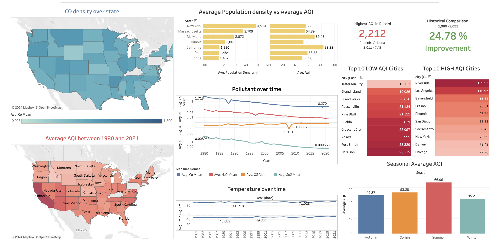

#  Air Quality Insights(AQI) : Leveraging Data Science for Climate Action
> Authors: Aditya Kandel, Zijun Ye, Kian Zahrai
>
> Group 20 Project Component - CSI4142: Fundamental of Data Science

## About 
**What is Air Quality Insights?** 
- Index used to determine air quality on a day-to-day basis
- Determine the impact of polluted air on our health in a given time period
- Measurement on amount of particles, not mass
- Data analytics → process of collecting, processing, and analyzing air quality data to extract meaningful insights

**Why we choose this topic?**
- A valuable source of information about the condition of the environment
- Investigate seasonal trends to identify the most impacted geographical locations
- Provide an outlook at mining and analyzing air quality data to aid in climate change efforts
- Determine the policies for taking action to reduce emissions

## Running Locally - instruction 
- Postgres database setup

## Design process
AQI is the primary way to measure the current quality of air, and our project intends to provide an outlook at mining and analyzing air quality data to aid in climate change efforts. The dataset's relevance to climate change and its potential to support various data science and policy-related objectives make it a valuable resource for such a project. In doing so, we aim to build a proposal system for local authorities, one where machine learning models are created for air quality forecasting, and providing evidence for policy-making decisions based on citizen-generated air quality data that signifies emissions, pollutant concentration, and vegetation. This US Air Quality dataset ([Kaggle](https://www.kaggle.com/datasets/calebreigada/us-air-quality-1980present)) provides a rich source of information for this data warehouse project, which is to be utilized in the different phases of the project by the following:

### Phase 1: Conceptual Design - Dimensional Model
In this phase, the focus is on understanding the business requirements and defining the high-level data model. The dataset will be used to identify the key entities and their relationships, such as pollutants, monitoring stations, geographical locations, and time dimensions. This will involve understanding the various attributes and their significance in the context of air quality monitoring.

> Grain of the data mart: The AQI, AQHI and visibility range, based upon a US state, on a specific date, with various concentrations of pollutants, of certain weather conditions, as recorded by a monitoring station.

### Phase 2: Physical Design and Data Staging
The physical design phase involves mapping the conceptual model to a physical schema and preparing the data for loading into the data warehouse. The dataset is to be staged and transformed to fit the designed schema via data cleaning, integration and other techniques to ensure consistency and quality of the data.

> High-Level Schema of Data Mart

### Phase 3: OLAP Queries and BI Dashboard
Once the data is loaded into the data warehouse, various data science techniques and analytical tools are applied to gain insights. OLAP queries are used to analyze air quality trends over time, across different pollutants, and geographical regions. Business Intelligence (BI) dashboards can be created to visualize the air quality metrics and provide interactive tools for exploration.

> BI Dashboard: Based on the visualizations provided below, our dashboard aims to be designed for exploring and analyzing air quality data across different geographical regions and time periods. The purpose of this dashboard is to provide users with a comprehensive and interactive tool to gain insights into air quality trends, identify areas of concern, and support data-driven decision-making processes related to environmental management and public health (All the following dashboards can be viewed here)

### Phase 4: Data Mining 
The dataset will finally undergo data mining to discover patterns and relationships that can help in predicting air quality, identifying factors influencing pollution levels, and suggesting measures for improvement.

## License 
[Datasets Used](https://drive.google.com/file/d/1p0F-jHzbMgouGrf6BxgvV328o7KwQNOt/view?usp=sharing)
